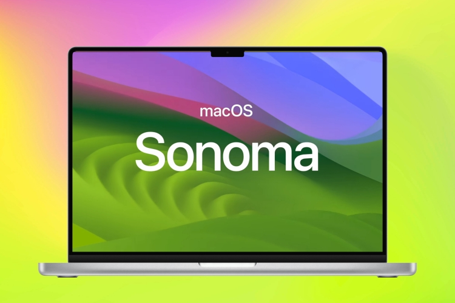

# macOS setup via Ansible

  
  

- This is my personal macOS setup using Ansible and will be updating it as I go along. (Currently compatible for macOS Sonoma 14.0)

## How to install

1. Make sure you have xcode-select installed: `xcode-select --install`
   1. export PATH="$HOME/Library/Python/3.9/bin:/opt/homebrew/bin:$PATH"
   2. sudo pip3 install ansible --upgrade pip
   3. pip3 install ansible
2. Clone this repo
3. Run `ansible-playbook main.yml -r requirements.yml` inside this directory. Enter your account password when prompted (for sudo access).
4. 

## What it sets up

- ...
